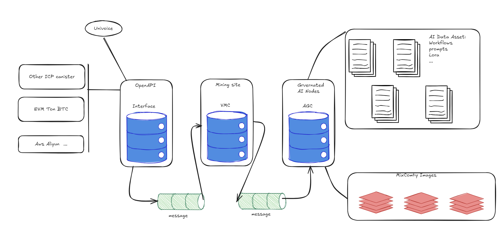

# UniVoice Agent

A publisher repository for the UniVoice project which can be easily integrated with the AIO-2030 platform.

[](https://internetcomputer.org/)
[](https://opensource.org/licenses/MIT)

## 📋 Overview

UniVoice is a decentralized AI voice generation and management platform built on the Internet Computer Protocol (ICP). It enables users to create, manage, and utilize AI-generated voice models through a system of canisters and distributed computing nodes.

The platform consists of several interconnected components:
- **Interface Canister (OpenAPI)**: Provides API access points for applications
- **VMC (Voice Model Canister)**: Manages voice model data and operations
- **AGC (Assert Canisters Group)**: Handles asset management and orchestration
- **Comfyui Nodes**: Distributed computing resources for AI processing

## 📐 Architecture

UniVoice employs a modular architecture built on ICP canisters with distributed computing nodes:


*Diagram 1: High-level architecture showing the relationship between Interface Canister, VMC, AGC, and Comfyui Nodes*


*Diagram 2: Detailed architecture showing the data flow between components*

### Key Components:

1. **Interface Canister (OpenAPI)**: 
   - Entry point for third-party integrations
   - Handles authentication and request routing
   - Connects to various blockchain networks (EVM, IoT, AWS)

2. **VMC (Voice Model Canister)**:
   - Manages voice model data and operations
   - Handles mining site operations
   - Processes voice model generation requests

3. **AGC (Assert Canisters Group)**:
   - Orchestrates AI workflows
   - Manages governance for model updates
   - Handles AI data assets (workflows, prompts, models)

4. **Comfyui Nodes**:
   - Distributed computing resources
   - Inner nodes for secure processing
   - Local nodes for edge computing

5. **IC-OSS Storage**:
   - Decentralized object storage service
   - Handles file management and access control
   - Supports the storage of models and generated content

## 🚧 Features & Milestones

### Core Features
- [x] AI voice model generation and management
- [x] Decentralized storage and computing
- [x] NFT-based licensing and ownership
- [] Integration with other blockchain networks

### Services
- **update_miner**: Update NFT holder for miner after NFT sale
- **update_wkflow**: Update workflow body by NNS voting
- **post_genai_proposal**: Post AIGC proposal
- **query_genai_proposal**: Query AIGC proposal
- **update_miner_contract**: Update/initialize miner contract
- **query_miner_contract**: Query miner contract
- **post_nft_contract**: Post NFT miner contract

## 💡 Getting Started

### Prerequisites
- [dfx](https://internetcomputer.org/docs/current/developer-docs/setup/install) - Internet Computer SDK

### Local Development

```bash
# Clone the repository
git clone https://github.com/yourusername/univoice-agent.git
cd univoice-agent

# Start the local Internet Computer replica
dfx start --background

# Deploy the project
dfx deploy
```

### Deploying a Specific Canister

```bash
# For deploying the mugc-agc canister
cd mugc-agc/
dfx deploy

# For deploying the univoice-vmc canister
cd univoice-vmc/
dfx deploy

# For deploying the univoice-dapp canister
cd univoice-dapp/
dfx deploy
```

### Deploying IC-OSS Storage

```bash
# Deploy ic_oss_bucket
dfx deploy ic_oss_bucket --argument "(opt variant {Init =
  record {
    name = \"Univoice Labs\";
    file_id = 0;
    max_file_size = 2048;
    max_folder_depth = 10;
    max_children = 1000;
    visibility = 0;
    max_custom_data_size = 4096;
    enable_hash_index = false;
  }
})"

# Deploy ic_oss_cluster
dfx deploy ic_oss_cluster --argument "(opt variant {Init =
  record {
    name = \"Univoice Labs\";
    ecdsa_key_name = \"test_key_1\";
    schnorr_key_name = \"test_key_1\";
    token_expiration = 3600;
    bucket_topup_threshold = 1_000_000_000_000;
    bucket_topup_amount = 5_000_000_000_000;
  }
})"
```

## 🔗 Resources

- [Internet Computer Documentation](https://internetcomputer.org/docs)
- [DFINITY Developer Portal](https://sdk.dfinity.org)
- [Rust Canister Development Guide](https://internetcomputer.org/docs/current/developer-docs/backend/rust/)
- [Candid Introduction](https://internetcomputer.org/docs/current/developer-docs/backend/candid/)

## 📄 License

This project is licensed under the MIT License - see the LICENSE file for details.
